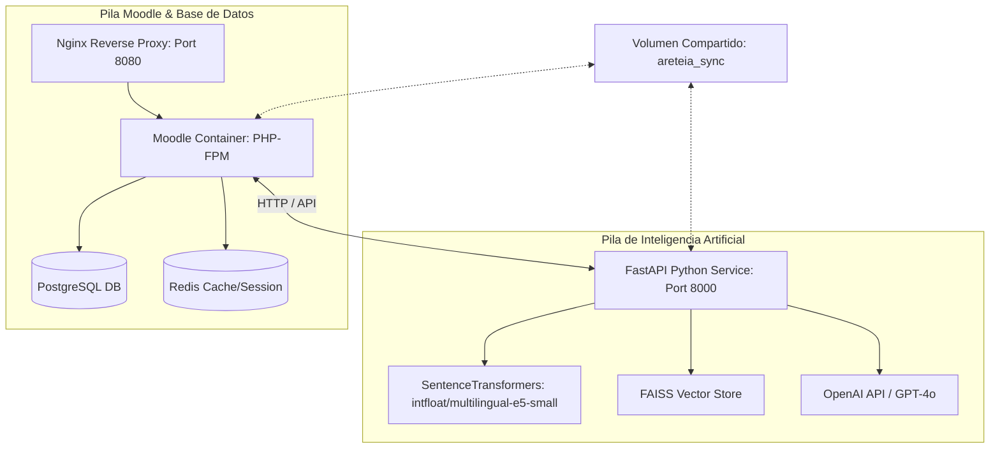
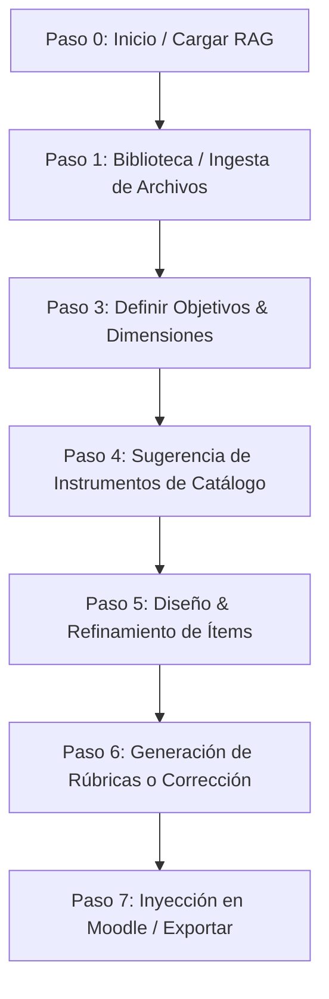

# AreteIA — Plataforma de Asistencia Pedagógica Basada en IA y RAG

AreteIA es una plataforma educativa de última generación que se integra en **Moodle** como un bloque local (`local/areteia`). Su propósito es asistir a los equipos docentes en el diseño, estructuración y alineación pedagógica de sus instrumentos de evaluación (tareas, cuestionarios y foros de debate) utilizando técnicas avanzadas de **RAG (Retrieval-Augmented Generation)** y LLMs (Modelos de Lenguaje de Gran Escala).

El sistema garantiza la **alineación constructiva**: las evaluaciones generadas se fundamentan estrictamente en el contenido real cargado en el aula virtual y siguen las directrices pedagógicas e institucionales definidas por la institución.

---

## 1. Arquitectura de Servicios del Sistema

La arquitectura está completamente contenedorizada mediante **Docker Compose**, dividida en dos pilas de servicios interconectadas:



### Componentes Clave:
1. **Petición del Usuario (Moodle UI):** El docente interactúa con la interfaz por pestañas en Moodle (`step_renderer.php`). Las solicitudes se envían al backend de Moodle.
2. **Cliente RAG (`rag_client.php`):** Moodle se comunica con el servicio de IA a través de llamadas HTTP de tipo REST hacia el contenedor `python_rag`.
3. **Servicio Python RAG (FastAPI):** Expone endpoints como `/ingest`, `/search`, `/generate` y `/status`. Controla la extracción de texto, vectorización y generación mediante LLM.
4. **Almacenamiento e Ingesta:** Los archivos seleccionados por el docente son extraídos del sistema de archivos de Moodle hacia el volumen compartido `/areteia_sync`, donde el servicio RAG los procesa.

---

## 2. El Rol de la IA: Embeddings, FAISS y RAG

El flujo RAG asegura que las evaluaciones no sufran de alucinaciones y contengan extractos textuales precisos de las lecturas y materiales del curso.

### A. ¿Qué son los Embeddings y Cuándo se Usan?
Un **Embedding** es una representación numérica (vector de dimensión 384 en este caso) de un fragmento de texto. Captura el significado semántico del texto: oraciones con significados similares quedan ubicadas cerca en el espacio vectorial.

*   **Durante la Ingesta (Construcción de la Biblioteca):** Los archivos `.pdf`, `.docx` y `.pptx` del curso se procesan. Cada archivo se divide en fragmentos mediante un `RecursiveCharacterTextSplitter` (tamaño de fragmento de **1000 caracteres**, solapamiento de **250**). Cada fragmento se convierte en un vector de embeddings utilizando el modelo **`intfloat/multilingual-e5-small`**.
*   **Durante la Búsqueda (Recuperación semántica):** Cuando el docente define los objetivos de aprendizaje (en texto libre), el sistema convierte esta consulta en un vector de embeddings. Se realiza una búsqueda vectorial para encontrar los fragmentos de documentos del curso semánticamente más relevantes para evaluar dicho objetivo.

> [!IMPORTANT]
> **Convención de Prefijos de E5:** El modelo de embeddings multilingüe E5 requiere el uso de prefijos específicos para optimizar la calidad de la búsqueda. Los fragmentos de documentos del curso se indexan con el prefijo `passage: `, mientras que las consultas de búsqueda se vectorizan usando el prefijo `query: `.

### B. ¿Para qué se usa FAISS?
**FAISS (Facebook AI Similarity Search)** es una librería de alto rendimiento para la búsqueda eficiente de similitudes en espacios vectoriales densos.
*   Actúa como nuestra base de datos vectorial local indexada por curso.
*   En lugar de comparar linealmente la consulta del usuario con miles de fragmentos de texto (lo cual sería muy lento), FAISS realiza operaciones de álgebra lineal optimizadas en CPU (limitadas a 8 hilos en este entorno para evitar saturación del host) para encontrar instantáneamente los fragmentos más cercanos mediante distancia coseno normalizada L2.
*   El índice FAISS resultante se guarda físicamente en disco (`index.faiss`) junto con un archivo serializado de metadatos (`metadata.pkl`) dentro del directorio del curso.

### C. Mapeo Pedagógico de Similitud
La similitud coseno de los embeddings de E5 tiende a concentrarse en un rango estrecho (generalmente entre `0.80` y `0.95`). Para hacer este valor intuitivo para un docente humano, el sistema implementa una función de mapeo estadístico (`map_score_pedagogical` en `search.py`):

*   Similitud $\ge 0.90$ $\rightarrow$ Escala de $85\%$ a $100\%$
*   Similitud entre $0.84$ y $0.90$ $\rightarrow$ Escala de $50\%$ a $85\%$
*   Similitud entre $0.80$ y $0.84$ $\rightarrow$ Escala de $5\%$ a $50\%$
*   Similitud $< 0.80$ $\rightarrow$ Se descarta el fragmento (debajo del umbral por defecto de 0.80).

---

## 3. Flujo Paso a Paso de AreteIA

La creación de recursos sigue un pipeline secuencial de 8 pasos en la interfaz de Moodle:



*   **Paso 0 - Carga RAG:** Detecta si existe un índice FAISS para el curso actual. Si no existe, invita a crearlo.
*   **Paso 1 - Crear Biblioteca:** El docente selecciona cuáles de los archivos del curso (extraídos de los recursos de Moodle) formarán la base documental del asistente de IA. Al presionar "Generar Biblioteca", se ejecuta el pipeline RAG y se crea el índice FAISS.
*   **Paso 3 - Configurar Evaluación:** El docente define las dimensiones pedagógicas:
    *   **D1 (Contenidos):** Temas específicos a evaluar.
    *   **D2 (Objetivos):** Declaraciones de aprendizaje y su nivel según la Taxonomía de Bloom.
    *   **D3 (Función):** Diagnóstica, Formativa o Sumativa.
    *   **D4 (Modalidad):** Presencial, Híbrida o A distancia.
*   **Paso 4 - Propuesta de Instrumentos:** La IA sugiere exactamente 3 instrumentos adecuados del catálogo maestro (por ejemplo, *Estudio de casos*, *Debate*, *Cuestionario*, *Ensayo*). El docente elige uno de ellos.
*   **Paso 5 - Diseñar Evaluación:** La IA redacta los ítems específicos de la evaluación (preguntas, consignas, rúbricas de partida) extrayendo el contenido clave mediante RAG. El docente puede ajustar ítems individuales o dar feedback global a la IA.
*   **Paso 6 - Instrumentos de Corrección:** Basado en la tabla de encaje pedagógico, se selecciona y genera el instrumento de corrección correspondiente (Rúbrica analítica, Escala de valoración, Lista de cotejo o Clave de respuestas).
*   **Paso 7 - Inyección a Moodle:** Se elige la sección del curso de Moodle y se exporta el recurso final de forma nativa e integrada.

---

## 4. Rutas Críticas para los 3 Recursos de Moodle

Una vez finalizado el diseño pedagógico con la IA, el sistema mapea el instrumento seleccionado a una de las tres actividades nativas de Moodle:

### 📋 A. Ruta 1: Tarea (Assignment)
Se activa para instrumentos de producción libre o evidencias complejas (ej: *Ensayo*, *Análisis de casos*, *Portafolio*, *Proyecto de investigación*).

1.  **Paso 4:** El docente selecciona un instrumento mapeado a tipo `assign` en `encaje_table.php`.
2.  **Paso 5:** La IA genera las consignas del instrumento, las directrices de entrega y los objetivos cubiertos.
3.  **Paso 6:** La IA genera una **Rúbrica Analítica** detallada (criterios, niveles y descriptores de logro) o una **Escala de valoración**.
4.  **Paso 7 (Inyección):** El backend llama a `data_provider::create_assign_activity()`.
    *   Crea una instancia de la actividad `assign` de Moodle en la sección elegida del curso.
    *   Genera una descripción en formato HTML/Markdown enriquecido que incluye: la descripción del instrumento, cada una de las consignas generadas por la IA con sus objetivos asociados, y la visualización de la Rúbrica de corrección para que los estudiantes conozcan los criterios de antemano.

### 📝 B. Ruta 2: Cuestionario (Quiz)
Se activa para instrumentos cerrados o pruebas mixtas (ej: *Cuestionario*, *Escape room*, *Prueba mixta*).

1.  **Paso 4:** El docente selecciona un instrumento mapeado a tipo `quiz` en `encaje_table.php`.
2.  **Paso 5:** La IA genera una batería de ítems estructurados. Los tipos permitidos son:
    *   *Opción múltiple* (`multichoice`): Enunciado, distractores y el índice correcto.
    *   *Verdadero/Falso* (`truefalse`): Afirmación y valor lógico.
    *   *Respuesta breve* (`shortanswer`): Pregunta y texto esperado exacto.
    *   *Ensayo* (`essay`): Pregunta abierta de desarrollo manual.
    *   *Numérica* (`numerical`): Problema y valor numérico esperado.
3.  **Paso 6:** La IA genera una **Clave de corrección** (Answer Key) con justificaciones pedagógicas del por qué de cada respuesta.
4.  **Paso 7 (Inyección):** El docente define el puntaje máximo (ej: 100 puntos) y la distribución porcentual de peso por pregunta. El backend llama a `data_provider::create_quiz_activity()`.
    *   Crea la actividad `quiz` en Moodle.
    *   Itera sobre las preguntas generadas e inserta cada una directamente en el **Banco de Preguntas** de Moodle con sus opciones correctas, retroalimentaciones y ponderaciones respectivas.
    *   Vincula dinámicamente las preguntas creadas al cuestionario.

### 💬 C. Ruta 3: Foro (Forum)
Se activa para actividades de discusión y co-evaluación (ej: *Debate*, *Evaluación oral*).

1.  **Paso 4:** El docente selecciona un instrumento mapeado a tipo `forum` en `encaje_table.php`.
2.  **Paso 5:** La IA diseña el tema del debate, las preguntas detonantes basadas en el material del curso y las reglas de participación e interacción entre estudiantes.
3.  **Paso 6:** La IA genera una **Lista de cotejo** o **Escala de valoración** para calificar la calidad de las participaciones.
4.  **Paso 7 (Inyección):** El backend llama a `data_provider::create_forum_activity()`.
    *   Crea la actividad `forum` de Moodle en la sección del curso.
    *   Configura la descripción del foro detallando el disparador del debate redactado por la IA, las pautas de netiqueta, los plazos mínimos, la rúbrica/escala de evaluación y los objetivos pedagógicos esperados.

---

## 5. Detalles de los Prompts y Rol de la IA por Paso

Los prompts se configuran en `llm.py` y se estructuran para devolver respuestas estrictamente formateadas en **JSON** para su fácil procesamiento por el backend PHP.

### 🔹 Paso 4: Propuesta de Sugerencias (`get_suggestions_prompt`)
*   **Rol de la IA:** Analizar el contexto semántico del curso y los objetivos definidos para sugerir 3 instrumentos del catálogo maestro que maximicen la alineación constructiva.
*   **Prompt:**
    ```text
    Tu tarea es proponer 3 instrumentos de evaluación que estén perfectamente alineados con los objetivos y el contexto del curso.

    ### 1. CONTEXTO GENERAL DEL CURSO:
    {course_summary}

    ### 2. OBJETIVOS DE APRENDIZAJE (Taxonomía de Bloom):
    {objective}

    ### 3. DIMENSIONES PEDAGÓGICAS DEFINIDAS:
    {dimensions}

    ### 4. MATERIALES DEL CURSO, DIRECTRICES Y CATÁLOGO DE INSTRUMENTOS:
    {full_context}
    {feedback_sect}

    ### INSTRUCCIONES CRÍTICAS:
    1. Debes elegir exactamente 3 instrumentos de la "LISTA DE INSTRUMENTOS DISPONIBLES" proporcionada arriba. El valor de "name" en tu respuesta debe ser el NOMBRE EXACTO del catálogo.
    2. Basándote en el contexto y las directrices, justifica detalladamente por qué cada uno de estos 3 instrumentos es la mejor opción.
    3. Cada propuesta debe estar justificada pedagógicamente, mencionando cómo se alinea con el nivel de Bloom y qué directriz institucional cumple.
    4. Responde UNICAMENTE en formato JSON:
    {
      "suggestions": [
        {
          "name": "Nombre exacto del catálogo",
          "why": "Justificación detallada citando el contexto y la directriz aplicada.",
          "lim": "Limitación técnica del instrumento."
        }
      ]
    }
    ```

### 🔹 Paso 5: Diseño del Instrumento (`get_design_prompt`)
*   **Rol de la IA:** Redactar y estructurar las preguntas/consignas de evaluación basándose en extractos específicos recuperados de los materiales del curso mediante RAG. Soporta refinamiento parcial (regeneración selectiva de un ítem si el docente lo solicita).
*   **Prompt:**
    ```text
    ### TAREA A REALIZAR:
    Diseñar una batería de {num_items} ítems de evaluación para un instrumento de tipo: {chosen_instrument}.

    **Descripción del instrumento:**
    {instrument_desc}

    ### OBJETIVOS DE LA EVALUACIÓN (CON EXTRACTOS Y REFERENCIAS):
    {structured_materials}

    ### TIPOS DE PREGUNTAS PERMITIDOS (DEBES ELEGIR SOLO DE ESTA LISTA):
    {types_str}
    
    {feedback_sect}
    {current_design_sect}

    ### REQUISITOS DE CALIDAD Y FORMATO:
    1. Genera exactamente {num_items} ítems.
    2. Cada ítem debe usar OBLIGATORIAMENTE uno de los "TIPOS DE PREGUNTAS PERMITIDOS" listados arriba. El campo "type" debe coincidir EXACTAMENTE con el nombre del tipo.
    3. Para cada ítem, identifica qué objetivos específicos de los listados arriba está cubriendo.
    4. Estructura JSON por Tipo y Respuestas Correctas:
        - Opción múltiple: Llena "consiga", "alternativas" (mínimo 4) y "correct_index" (0-indexed).
        - Verdadero/Falso: Llena "consiga" y "correct_boolean".
        - Emparejamiento / Poner en orden: "consiga" y la lista "pairs" con {"premise": "...", "answer": "..."}.
        - Respuesta breve / Texto lacunar: "consiga" y "short_answer".
        - Numérica: "consiga" y "numerical_value".
        - Ensayo / Respuesta abierta: "consiga" (sin respuesta predefinida).
    5. Los ítems deben redactarse con rigor pedagógico y coherencia con los extractos de los materiales proporcionados.
    6. Asigna una dificultad ("Fácil", "Media", "Difícil").
    7. Refinamiento Parcial: Si en los ajustes se menciona un ítem (ej: [Ítem 1] ...), regenera ese ítem aplicando los cambios solicitados manteniendo el resto igual.

    ### FORMATO DE RESPUESTA (JSON ÚNICAMENTE):
    {
      "title": "Título descriptivo del instrumento",
      "items": [
        {
          "type": "Nombre exacto del tipo",
          "objectives": ["Obj 1"],
          "consiga": "...",
          "difficulty": "Media",
          ...
        }
      ],
      "justification": "Explica la coherencia pedagógica de la selección."
    }
    ```

### 🔹 Paso 6: Generación de Rúbricas (`get_rubric_prompt`)
*   **Rol de la IA:** Crear una rúbrica analítica detallada alineada con las directrices institucionales globales (RAG de directrices globales, `course_id=0`) y los objetivos del curso.
*   **Prompt:**
    ```text
    Como experto en evaluación, genera una RÚBRICA ANALÍTICA para el siguiente instrumento.

    ### INSTRUMENTO A EVALUAR:
    {instrument_content}

    ### OBJETIVOS DE APRENDIZAJE:
    {objective}

    ### MARCO PEDAGÓGICO Y REGLAS DE RÚBRICAS:
    {full_context}
    {feedback_sect}

    ### REQUISITOS:
    1. Define criterios claros y discriminativos basados en los materiales del curso.
    2. Los descriptores de niveles deben seguir las reglas de redacción de las DIRECTRICES PEDAGÓGICAS.
    3. Asegura una progresión lógica en los puntajes.

    ### FORMATO DE RESPUESTA (JSON ÚNICAMENTE):
    {
      "title": "Rúbrica de Evaluación",
      "criteria": [
        {
          "name": "Nombre del criterio",
          "description": "Qué se evalúa",
          "levels": [
            {
              "label": "Nivel (ej: Destacado)",
              "score": 10,
              "description": "Descriptor de desempeño"
            }
          ]
        }
      ]
    }
    ```

### 🔹 Paso 9: Generación del Instrumento de Corrección (`get_correction_prompt`)
*   **Rol de la IA:** Dependiendo del instrumento elegido, genera una de las siguientes cuatro estructuras JSON: Clave de corrección, Lista de cotejo, Escala de valoración o Rúbrica pedagógica completa.
*   **Prompt:**
    ```text
    ### TAREA A REALIZAR:
    Genera {descripción_del_tipo_corrección} para un instrumento de evaluación de tipo "{chosen_instrument}".

    ### OBJETIVOS DE APRENDIZAJE:
    {objective}

    ### INSTRUMENTO DE EVALUACIÓN (Ítems generados previamente):
    {instrument_content}

    ### ÍTEMS DEL CUESTIONARIO (JSON):
    {quiz_items_json}

    ### MARCO PEDAGÓGICO Y DIRECTRICES:
    {full_context}
    {feedback_sect}

    ### INSTRUCCIONES CRÍTICAS:
    1. El instrumento de corrección debe estar perfectamente alineado con los ítems de evaluación proporcionados.
    2. Cada criterio debe ser claro, observable y pedagógicamente fundamentado.
    3. Basa los criterios en los objetivos de aprendizaje y los materiales del curso.
    4. Responde ÚNICAMENTE en formato JSON según el esquema indicado abajo.

    ### FORMATO DE RESPUESTA (JSON ÚNICAMENTE):
    {esquema_json_específico_del_tipo_elegido}
    ```

---

## 6. Comandos Útiles y Gestión de Contenedores

Para administrar, levantar y verificar el estado del sistema, utiliza los siguientes comandos dentro de la carpeta del proyecto:

### Levantar y construir el sistema (Modo Background)
```bash
docker compose up -d --build
```

### Ver el estado de todos los contenedores
```bash
docker compose ps
```

### Monitorear los logs en tiempo real del servicio de IA
```bash
docker compose logs -f python_rag
```

### Forzar la recreación del contenedor de RAG tras editar variables en `.env`
```bash
docker compose up -d python_rag --force-recreate
```

### Detener el sistema completo manteniendo los datos persistentes
```bash
docker compose down
```
