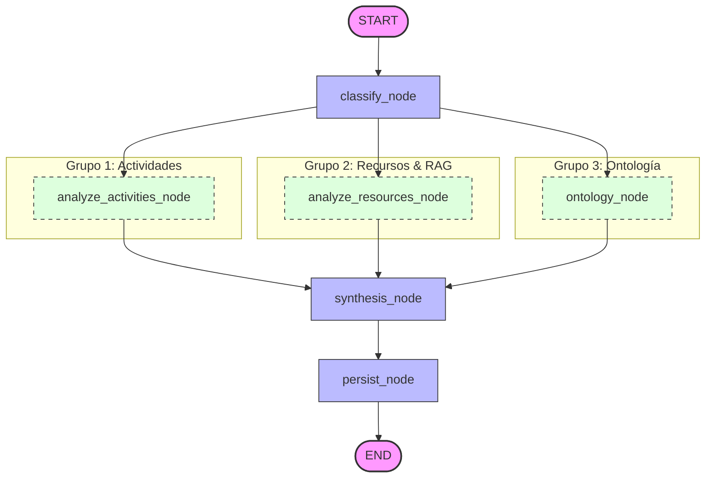

# RubricAI — Motor de IA basado en LangGraph

Este subdirectorio contiene el microservicio de Inteligencia Artificial de **RubricAI** desarrollado con **FastAPI**. Su función principal es orquestar la auditoría pedagógica de los cursos de Moodle utilizando un flujo de trabajo multi-agente en paralelo basado en **LangGraph** y **LangSmith Tracing**.

---

## 1. Arquitectura y Topología del Grafo

La evaluación de RubricAI se modela como un grafo de estado dirigido de **LangGraph** (`graph.py`). La arquitectura implementa un patrón de bifurcación y unificación (**Fan-out / Fan-in**) que permite ejecutar tres flujos de análisis de forma paralela e independiente, reduciendo drásticamente el tiempo total de procesamiento.



---

## 2. El Estado del Grafo (`EvaluationState`)

Todos los nodos del grafo leen y escriben sobre un estado compartido y tipado llamado `EvaluationState` (`TypedDict` en `graph.py`):

```python
class EvaluationState(TypedDict):
    # Entradas de la auditoría (Moodle)
    course_id: int
    rubric_id: str
    course_data: dict
    rubric_data: dict

    # Resultados del Grupo de Actividades
    html_analysis: str
    quiz_analysis: str
    assignment_analysis: str
    forum_analysis: str

    # Resultados del Grupo de Recursos
    document_analysis: str
    youtube_analysis: str
    url_analysis: str

    # Resultados del Grafo Ontológico
    ontology_analysis: dict

    # Consolidado Final de Auditoría
    final_result: dict
```

---

## 3. Detalle de los Nodos de Ejecución

### 3.1. Nodo Inicial: `classify`
* **Función:** `classifier_node`
* **Acción:** Recibe los datos del curso y el ID de la rúbrica. Consulta la base de datos de grafos **Neo4j Aura** para recuperar la rúbrica institucional correspondiente. Si no se encuentra, genera una rúbrica genérica de calidad pedagógica como fallback.
* **Metadatos:** Registra en LangSmith la información del curso, rúbrica y número de criterios a evaluar.

### 3.2. Ramas en Paralelo (Fan-out)

Al terminar el nodo `classify`, el grafo bifurca el flujo en tres ramas que se ejecutan de manera simultánea:

#### Rama A: `analyze_activities` (Grupo de Actividades)
Ejecuta secuencialmente los agentes encargados de evaluar la interacción interactiva dentro del aula de Moodle:
1. **`HTMLContentAgent`:** Limpia el HTML de las introducciones de todas las actividades y audita su calidad descriptiva y claridad instruccional.
2. **`QuizAgent`:** Audita cuestionarios (tipos de preguntas, taxonomía de Bloom implícita, límites de tiempo, intentos y consistencia de plazos).
3. **`AssignmentAgent`:** Evalúa el diseño pedagógico y configuraciones de envío de las tareas (`assign`).
4. **`ForumAgent`:** Analiza si las consignas de los foros de discusión pedagógicos promueven el pensamiento crítico y la interacción social.

#### Rama B: `analyze_resources` (Grupo de Recursos y Materiales)
Audita el contenido de apoyo teórico y lecturas disponibles para los estudiantes:
1. **`DocumentAgent` (RAG):** Utiliza recuperación aumentada por generación (**RAG** con embeddings `multilingual-e5-small` y base vectorial local **FAISS**) para contrastar el contenido semántico real de los documentos del curso (`.pdf`, `.docx`, `.pptx`) contra la rúbrica institucional.
2. **`YouTubeAgent`:** Detecta enlaces o videos incrustados de YouTube, descarga sus transcripciones públicas mediante `youtube-transcript-api` de forma asíncrona y analiza su relevancia temática.
3. **`URLResourceAgent`:** Audita la confiabilidad de los enlaces a páginas web externas no pertenecientes a Moodle ni YouTube.

#### Rama C: `ontology` (Sincronización Ontológica)
Interactúa directamente con **Neo4j** en paralelo con los análisis de agentes:
1. Sincroniza la estructura jerárquica del curso Moodle (secciones, actividades y recursos) como nodos y relaciones.
2. Realiza un mapeo semántico de los criterios de la rúbrica para identificar qué áreas pedagógicas del curso están cubiertas.

### 3.3. Nodo de Consolidación (Fan-in): `synthesis`
* **Función:** `synthesis_node`
* **Acción:** Espera a que las tres ramas paralelas terminen. Recibe todos los reportes individuales y los inyecta en el **`SynthesisAgent`**. Este agente realiza una evaluación global, calcula el puntaje final (`overall_score`) y estructura el plan de acción final en un JSON válido con las recomendaciones accionables sugeridas.

### 3.4. Nodo Final: `persist`
* **Función:** `persist_node`
* **Acción:** Guarda el puntaje final y las sugerencias estructuradas del `SynthesisAgent` en la base de datos de grafos de Neo4j para alimentar el Dashboard interactivo del frontend.

---

## 4. Funcionamiento del Paralelismo en LangGraph

LangGraph gestiona el paralelismo de forma nativa e interna. Al compilar el grafo con `StateGraph(EvaluationState)` y declarar múltiples aristas salientes desde un mismo nodo:

```python
# Fan-out: classify apunta a tres nodos en paralelo
graph.add_edge("classify", "analyze_activities")
graph.add_edge("classify", "analyze_resources")
graph.add_edge("classify", "ontology")
```

El motor de ejecución de LangGraph detecta que no existen dependencias cruzadas entre `analyze_activities`, `analyze_resources` y `ontology`. Por lo tanto, utiliza un pool de hilos (`ThreadPoolExecutor` de Python de forma subyacente en su runtime asíncrono) para disparar la ejecución de los tres nodos simultáneamente.

El punto de encuentro (Fan-in) se declara definiendo que múltiples nodos apuntan al nodo unificador:

```python
# Fan-in: los tres flujos convergen en 'synthesis'
graph.add_edge("analyze_activities", "synthesis")
graph.add_edge("analyze_resources", "synthesis")
graph.add_edge("ontology", "synthesis")
```

El runtime de LangGraph congela el flujo y realiza una unificación de estados (*state merging*). El nodo `synthesis` no iniciará su ejecución hasta que las tres ramas hayan completado su procesamiento y escrito sus respectivos resultados en el estado.

---

## 5. Observabilidad Completa con LangSmith

El microservicio está instrumentado de arriba a abajo con **LangSmith Tracing** (`tracing.py`) para permitir auditar el comportamiento de los agentes y medir los tiempos de ejecución de las llamadas asíncronas:

1. **Jerarquía de Ejecución:** Gracias a la adición del decorador `@trace_agent` en los nodos de `graph.py`, en el dashboard de LangSmith verás la ejecución paralela organizada en un árbol limpio:
   * `moodle_evaluate` (Petición HTTP entrante de FastAPI)
     * `multi_agent_evaluation` (Orquestación del Grafo)
       * `graph_node_classifier` (Nodo de clasificación)
       * `graph_node_activities` (Nodo de Actividades)
         * `html_content_agent` $\rightarrow$ LLM
         * `quiz_agent` $\rightarrow$ LLM
         * `assignment_agent` $\rightarrow$ LLM
         * `forum_agent` $\rightarrow$ LLM
       * `graph_node_resources` (Nodo de Recursos)
         * `document_agent` $\rightarrow$ Búsquedas RAG $\rightarrow$ LLM
         * `youtube_agent` $\rightarrow$ Descarga transcripción $\rightarrow$ LLM
         * `url_resource_agent` $\rightarrow$ LLM
       * `graph_node_ontology` (Nodo de Neo4j)
       * `graph_node_synthesis` (Unificación y Síntesis)
         * `synthesis_agent` $\rightarrow$ LLM
       * `graph_node_persist` (Guardado final)
2. **Monitoreo de RAG (`@trace_rag`):** Las búsquedas vectoriales a FAISS se registran de forma detallada como spans tipo `retriever`, permitiéndote inspeccionar exactamente qué fragmentos de PDFs se inyectaron en el contexto del modelo de lenguaje.
